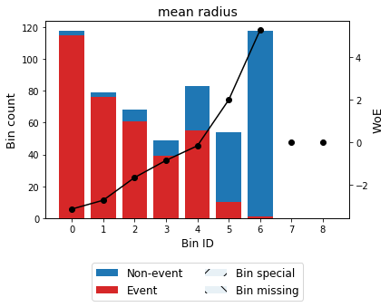
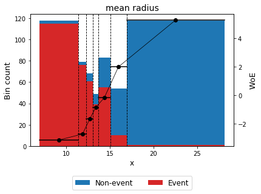
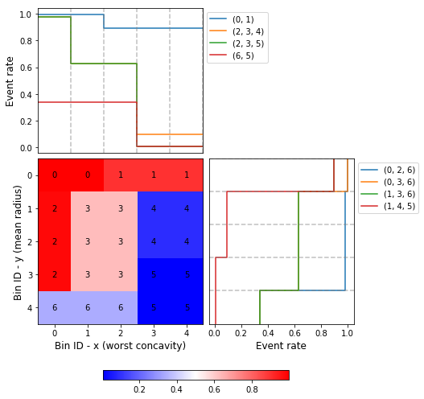

==========
OptBinning
==========

.. image::  https://github.com/guillermo-navas-palencia/optbinning/workflows/CI/badge.svg
   :target: https://github.com/guillermo-navas-palencia/optbinning/workflows/CI/badge.svg

.. image::  https://img.shields.io/github/license/guillermo-navas-palencia/optbinning
   :target: https://img.shields.io/github/license/guillermo-navas-palencia/optbinning

.. image:: https://img.shields.io/badge/python-3.7%20%7C%203.8%20%7C%203.9%20%7C%203.10-blue
   :target: https://img.shields.io/badge/python-3.7%20%7C%203.8%20%7C%203.9%20%7C%203.10-blue

.. image:: https://img.shields.io/pypi/v/optbinning?color=blueviolet
   :target: https://img.shields.io/pypi/v/optbinning?color=blueviolet

.. image:: https://static.pepy.tech/badge/optbinning
   :target: https://pepy.tech/project/optbinning

.. image:: https://static.pepy.tech/badge/optbinning/month
   :target: https://pepy.tech/project/optbinning/month

**OptBinning** is a library written in Python implementing a rigorous and flexible mathematical programming formulation to solve the optimal binning problem for a binary, continuous and multiclass target type, incorporating constraints not previously addressed.

* **Papers**:
   * Optimal binning: mathematical programming formulation. http://arxiv.org/abs/2001.08025
   * Optimal counterfactual explanations for scorecard modelling. https://arxiv.org/abs/2104.08619
* **Blog**: Optimal binning for streaming data. http://gnpalencia.org/blog/2020/binning_data_streams/

.. list-table::

    * - .. figure:: doc/source/_images/binning_binary.png

      - .. figure:: doc/source/_images/binning_data_stream.gif

.. list-table::

    * - .. figure:: doc/source/_images/binning_2d_readme.png

      - .. figure:: doc/source/_images/binning_2d_readme_woe.png

.. contents:: **Table of Contents**

Installation
============

To install the current release of OptBinning from PyPI:

.. code-block:: text

   pip install optbinning

To include batch and stream binning algorithms (this option is not required for most users):

.. code-block:: text

  pip install optbinning[distributed]

To install from source, download or clone the git repository

.. code-block:: text

   git clone https://github.com/guillermo-navas-palencia/optbinning.git
   cd optbinning
   python setup.py install

Dependencies
------------
OptBinning requires

* matplotlib
* numpy (>=1.16.1)
* ortools (>=9.4)
* pandas
* ropwr (>=1.0.0)
* scikit-learn (>=1.0.2)
* scipy (>=1.6.0)

OptBinning[distributed] requires additional packages

* pympler
* tdigest

Getting started
===============

Please visit the OptBinning documentation (**current** release) http://gnpalencia.org/optbinning/. If your are new to OptBinning, you can get started following the `tutorials <http://gnpalencia.org/optbinning/tutorials.html>`_ and checking the API references.

Tutorials
---------

* `Optimal binning tutorials <http://gnpalencia.org/optbinning/tutorials.html#optimal-binning-tutorials>`_
* `Binning process tutorials <http://gnpalencia.org/optbinning/tutorials.html#binning-process-tutorials>`_
* `Scorecard and counterfactual tutorials <http://gnpalencia.org/optbinning/tutorials.html#scorecard-tutorials>`_
* `Optimal piecewise binning tutorials <http://gnpalencia.org/optbinning/tutorials.html#optimal-piecewise-binning-tutorials>`_
* `Batch and stream optimal binning tutorials <http://gnpalencia.org/optbinning/tutorials.html#optimal-binning-for-batch-and-streaming-data-processing>`_
* `Optimal binning under uncertainty <http://gnpalencia.org/optbinning/tutorials.html#optimal-binning-under-uncertainty>`_
* `Optimal binning 2D <http://gnpalencia.org/optbinning/tutorials.html#optimal-binning-2d>`_

Example: Optimal binning with binary target
-------------------------------------------

Let's load a well-known dataset from the UCI repository and choose a variable to discretize and the binary target.

.. code-block:: python

   import pandas as pd
   from sklearn.datasets import load_breast_cancer

   data = load_breast_cancer()
   df = pd.DataFrame(data.data, columns=data.feature_names)

   variable = "mean radius"
   x = df[variable].values
   y = data.target

Import and instantiate an ``OptimalBinning`` object class. We pass the variable name, its data type, and a solver, in this case, we choose the constraint programming solver. Fit the optimal binning object with arrays ``x`` and ``y``.

.. code-block:: python

   from optbinning import OptimalBinning
   optb = OptimalBinning(name=variable, dtype="numerical", solver="cp")
   optb.fit(x, y)

Check status and retrieve optimal split points

.. code-block:: python

   >>> optb.status
   'OPTIMAL'

   >>> optb.splits
   array([11.42500019, 12.32999992, 13.09499979, 13.70499992, 15.04500008,
          16.92500019])

The optimal binning algorithms return a binning table; a binning table displays the binned data and several metrics for each bin. Call the method ``build``, which returns a pandas.DataFrame.

.. code-block:: python

   >>> optb.binning_table.build()

.. code-block:: text

                      Bin  Count  Count (%)  Non-event  Event  Event rate       WoE        IV        JS
   0        [-inf, 11.43)    118   0.207381          3    115    0.974576  -3.12517  0.962483  0.087205
   1       [11.43, 12.33)     79   0.138840          3     76    0.962025  -2.71097  0.538763  0.052198
   2       [12.33, 13.09)     68   0.119508          7     61    0.897059  -1.64381  0.226599  0.025513
   3       [13.09, 13.70)     49   0.086116         10     39    0.795918 -0.839827  0.052131  0.006331
   4       [13.70, 15.05)     83   0.145870         28     55    0.662651 -0.153979  0.003385  0.000423
   5       [15.05, 16.93)     54   0.094903         44     10    0.185185   2.00275  0.359566  0.038678
   6         [16.93, inf)    118   0.207381        117      1    0.008475   5.28332  2.900997  0.183436
   7              Special      0   0.000000          0      0    0.000000         0  0.000000  0.000000
   8              Missing      0   0.000000          0      0    0.000000         0  0.000000  0.000000
   Totals                    569   1.000000        212    357    0.627417            5.043925  0.393784

You can use the method ``plot`` to visualize the histogram and WoE or event rate curve. Note that the Bin ID corresponds to the binning table index.

.. code-block:: python

   >>> optb.binning_table.plot(metric="woe")

Optionally, you can show the binning plot with the actual bin widths.

.. code-block:: python

   >>> optb.binning_table.plot(metric="woe", style="actual", add_special=False, add_missing=False)

Now that we have checked the binned data, we can transform our original data into WoE or event rate values.

.. code-block:: python

   x_transform_woe = optb.transform(x, metric="woe")
   x_transform_event_rate = optb.transform(x, metric="event_rate")

The ``analysis`` method performs a statistical analysis of the binning table, computing the statistics Gini index, Information Value (IV), Jensen-Shannon divergence, and the quality score. Additionally, several statistical significance tests between consecutive bins of the contingency table are performed.

.. code-block:: python

   >>> optb.binning_table.analysis()

.. code-block:: text

   ---------------------------------------------
   OptimalBinning: Binary Binning Table Analysis
   ---------------------------------------------

     General metrics

       Gini index               0.87541620
       IV (Jeffrey)             5.04392547
       JS (Jensen-Shannon)      0.39378376
       Hellinger                0.47248971
       Triangular               1.25592041
       KS                       0.72862164
       HHI                      0.15727342
       HHI (normalized)         0.05193260
       Cramer's V               0.80066760
       Quality score            0.00000000

     Monotonic trend            descending

     Significance tests

       Bin A  Bin B  t-statistic       p-value  P[A > B]      P[B > A]
           0      1     0.252432  6.153679e-01  0.684380  3.156202e-01
           1      2     2.432829  1.188183e-01  0.948125  5.187465e-02
           2      3     2.345804  1.256207e-01  0.937874  6.212635e-02
           3      4     2.669235  1.023052e-01  0.955269  4.473083e-02
           4      5    29.910964  4.523477e-08  1.000000  9.814594e-12
           5      6    19.324617  1.102754e-05  0.999999  1.216668e-06

Print overview information about the options settings, problem statistics, and the solution of the computation.

.. code-block:: python

   >>> optb.information(print_level=2)

.. code-block:: text

   optbinning (Version 0.18.0)
   Copyright (c) 2019-2023 Guillermo Navas-Palencia, Apache License 2.0

     Begin options
       name                         mean radius   * U
       dtype                          numerical   * d
       prebinning_method                   cart   * d
       solver                                cp   * d
       divergence                            iv   * d
       max_n_prebins                         20   * d
       min_prebin_size                     0.05   * d
       min_n_bins                            no   * d
       max_n_bins                            no   * d
       min_bin_size                          no   * d
       max_bin_size                          no   * d
       min_bin_n_nonevent                    no   * d
       max_bin_n_nonevent                    no   * d
       min_bin_n_event                       no   * d
       max_bin_n_event                       no   * d
       monotonic_trend                     auto   * d
       min_event_rate_diff                    0   * d
       max_pvalue                            no   * d
       max_pvalue_policy            consecutive   * d
       gamma                                  0   * d
       class_weight                          no   * d
       cat_cutoff                            no   * d
       user_splits                           no   * d
       user_splits_fixed                     no   * d
       special_codes                         no   * d
       split_digits                          no   * d
       mip_solver                           bop   * d
       time_limit                           100   * d
       verbose                            False   * d
     End options

     Name    : mean radius
     Status  : OPTIMAL

     Pre-binning statistics
       Number of pre-bins                     9
       Number of refinements                  1

     Solver statistics
       Type                                  cp
       Number of booleans                    26
       Number of branches                    58
       Number of conflicts                    0
       Objective value                  5043922
       Best objective bound             5043922

     Timing
       Total time                          0.04 sec
       Pre-processing                      0.00 sec   (  0.33%)
       Pre-binning                         0.00 sec   (  5.54%)
       Solver                              0.04 sec   ( 93.03%)
         model generation                  0.03 sec   ( 85.61%)
         optimizer                         0.01 sec   ( 14.39%)
       Post-processing                     0.00 sec   (  0.30%)

Example: Optimal binning 2D with binary target
----------------------------------------------

In this case, we choose two variables to discretized and the binary target.

.. code-block:: python

   import pandas as pd
   from sklearn.datasets import load_breast_cancer

   data = load_breast_cancer()
   df = pd.DataFrame(data.data, columns=data.feature_names)

   variable1 = "mean radius"
   variable2 = "worst concavity"
   x = df[variable1].values
   y = df[variable2].values
   z = data.target

Import and instantiate an ``OptimalBinning2D`` object class. We pass the variable names, and monotonic trends. Fit the optimal binning object with arrays ``x``, ``y`` and ``z``.

.. code-block:: python

   from optbinning import OptimalBinning2D
   optb = OptimalBinning2D(name_x=variable1, name_y=variable2, monotonic_trend_x="descending",
                           monotonic_trend_y="descending", min_bin_size=0.05)
   optb.fit(x, y, z)

Show binning table:

.. code-block:: python

   >>> optb.binning_table.build()

.. code-block:: text

                   Bin x         Bin y  Count  Count (%)  Non-event  Event  Event rate       WoE        IV        JS
   0        (-inf, 13.70)  (-inf, 0.21)    219   0.384886          1    218    0.995434 -4.863346  2.946834  0.199430
   1         [13.70, inf)  (-inf, 0.21)     48   0.084359          5     43    0.895833 -1.630613  0.157946  0.017811
   2        (-inf, 13.09)  [0.21, 0.38)     48   0.084359          1     47    0.979167 -3.328998  0.422569  0.037010
   3       [13.09, 15.05)  [0.21, 0.38)     46   0.080844         17     29    0.630435 -0.012933  0.000013  0.000002
   4         [15.05, inf)  [0.21, 0.32)     32   0.056239         29      3    0.093750  2.789833  0.358184  0.034271
   5         [15.05, inf)   [0.32, inf)    129   0.226714        128      1    0.007752  5.373180  3.229133  0.201294
   6        (-inf, 15.05)   [0.38, inf)     47   0.082601         31     16    0.340426  1.182548  0.119920  0.014173
   7              Special       Special      0   0.000000          0      0    0.000000  0.000000  0.000000  0.000000
   8              Missing       Missing      0   0.000000          0      0    0.000000  0.000000  0.000000  0.000000
   Totals                                  569   1.000000        212    357    0.627417            7.234600  0.503991

Similar to the optimal binning, you can generate a histogram 2D to visualize WoE and event rate.

.. code-block:: python

   >>> optb.binning_table.plot(metric="event_rate")

Example: Scorecard with continuous target
-----------------------------------------

Let's load the California housing dataset.

.. code-block:: python

   import pandas as pd

   from sklearn.datasets import fetch_california_housing
   from sklearn.linear_model import HuberRegressor

   from optbinning import BinningProcess
   from optbinning import Scorecard

   data = fetch_california_housing()

   target = "target"
   variable_names = data.feature_names
   X = pd.DataFrame(data.data, columns=variable_names)
   y = data.target

Instantiate a binning process, an estimator, and a scorecard with scaling
method and reverse mode.

.. code-block:: python

   binning_process = BinningProcess(variable_names)

   estimator = HuberRegressor(max_iter=200)

   scorecard = Scorecard(binning_process=binning_process, estimator=estimator,
                         scaling_method="min_max",
                         scaling_method_params={"min": 0, "max": 100},
                         reverse_scorecard=True)

   scorecard.fit(X, y)

Print overview information about the options settings, problems statistics,
and the number of selected variables after the binning process.

.. code-block:: python

   >>> scorecard.information(print_level=2)

.. code-block:: text

   optbinning (Version 0.18.0)
   Copyright (c) 2019-2023 Guillermo Navas-Palencia, Apache License 2.0

     Begin options
       binning_process                      yes   * U
       estimator                            yes   * U
       scaling_method                   min_max   * U
       scaling_method_params                yes   * U
       intercept_based                    False   * d
       reverse_scorecard                   True   * U
       rounding                           False   * d
       verbose                            False   * d
     End options

     Statistics
       Number of records                  20640
       Number of variables                    8
       Target type                   continuous

       Number of numerical                    8
       Number of categorical                  0
       Number of selected                     8

     Timing
       Total time                          2.31 sec
       Binning process                     1.83 sec   ( 79.00%)
       Estimator                           0.41 sec   ( 17.52%)
       Build scorecard                     0.08 sec   (  3.40%)
         rounding                          0.00 sec   (  0.00%)

.. code-block:: python

   >>> scorecard.table(style="summary")

Two scorecard styles are available: ``style="summary"`` shows the variable name, and their corresponding bins and assigned points; ``style="detailed"`` adds information from the corresponding binning table.

.. code-block:: text

        Variable                 Bin     Points
   0      MedInc        [-inf, 1.90)   9.869224
   1      MedInc        [1.90, 2.16)  10.896940
   2      MedInc        [2.16, 2.37)  11.482997
   3      MedInc        [2.37, 2.66)  12.607805
   4      MedInc        [2.66, 2.88)  13.609078
   ..        ...                 ...        ...
   2   Longitude  [-118.33, -118.26)  10.470401
   3   Longitude  [-118.26, -118.16)   9.092391
   4   Longitude      [-118.16, inf)  10.223936
   5   Longitude             Special   1.376862
   6   Longitude             Missing   1.376862

   [94 rows x 3 columns]

.. code-block:: python

   >>> scorecard.table(style="detailed")

.. code-block:: text

        Variable  Bin id                 Bin  Count  Count (%)  ...  Zeros count       WoE        IV  Coefficient     Points
   0      MedInc       0        [-inf, 1.90)   2039   0.098789  ...            0 -0.969609  0.095786     0.990122   9.869224
   1      MedInc       1        [1.90, 2.16)   1109   0.053731  ...            0 -0.836618  0.044952     0.990122  10.896940
   2      MedInc       2        [2.16, 2.37)   1049   0.050824  ...            0 -0.760779  0.038666     0.990122  11.482997
   3      MedInc       3        [2.37, 2.66)   1551   0.075145  ...            0 -0.615224  0.046231     0.990122  12.607805
   4      MedInc       4        [2.66, 2.88)   1075   0.052083  ...            0 -0.485655  0.025295     0.990122  13.609078
   ..        ...     ...                 ...    ...        ...  ...          ...       ...       ...          ...        ...
   2   Longitude       2  [-118.33, -118.26)   1120   0.054264  ...            0 -0.011006  0.000597     0.566265  10.470401
   3   Longitude       3  [-118.26, -118.16)   1127   0.054603  ...            0 -0.322802  0.017626     0.566265   9.092391
   4   Longitude       4      [-118.16, inf)   6530   0.316376  ...            0 -0.066773  0.021125     0.566265  10.223936
   5   Longitude       5             Special      0   0.000000  ...            0 -2.068558  0.000000     0.566265   1.376862
   6   Longitude       6             Missing      0   0.000000  ...            0 -2.068558  0.000000     0.566265   1.376862

   [94 rows x 14 columns]

Compute score and predicted target using the fitted estimator.

.. code-block:: python

   score = scorecard.score(X)
   y_pred = scorecard.predict(X)

Example: Counterfactual explanations for scorecard with continuous target
-------------------------------------------------------------------------

First, we load the dataset and a scorecard previously developed.

.. code-block:: python

   import pandas as pd

   from optbinning import Scorecard
   from optbinning.scorecard import Counterfactual

   from sklearn.datasets import load_boston

   data = load_boston()
   X = pd.DataFrame(data.data, columns=data.feature_names)

   scorecard = Scorecard.load("myscorecard.pkl")

We create a new Counterfactual instance that is fitted with the dataset
used during the scorecard development. Then, we select a sample from which to generate
counterfactual explanations.

.. code-block:: python

   cf = Counterfactual(scorecard=scorecard)
   cf.fit(X)

   query = X.iloc[0, :].to_frame().T

The scorecard model predicts 26.8. However, we would like to find out what needs to be
changed to return a prediction greater or equal to 30.

.. code-block:: python

   >>> query
         CRIM    ZN  INDUS  CHAS    NOX     RM   AGE   DIS  RAD    TAX  PTRATIO      B  LSTAT
   0  0.00632  18.0   2.31   0.0  0.538  6.575  65.2  4.09  1.0  296.0     15.3  396.9   4.98

   >>> scorecard.predict(query)
   array([26.83423364])

We can generate a single counterfactual explanation:

.. code-block:: python

   >>> cf.generate(query=query, y=30, outcome_type="continuous", n_cf=1, max_changes=3,
                   hard_constraints=["min_outcome"])

   >>> cf.status
   'OPTIMAL'

   >>> cf.display(show_only_changes=True, show_outcome=True)
              CRIM ZN INDUS CHAS           NOX            RM AGE DIS RAD TAX PTRATIO  B LSTAT   outcome
   0  [0.04, 0.07)  -     -    -  [0.45, 0.50)  [6.94, 7.44)   -   -   -   -       -  -     -  31.28763

Or simultaneously three counterfactuals, enforcing diversity on the feature values and selecting only a few actionable features.

.. code-block:: python

   >>> cf.generate(query=query, y=30, outcome_type="continuous", n_cf=3, max_changes=3,
                   hard_constraints=["diversity_values", "min_outcome"],
                   actionable_features=["CRIM", "NOX", "RM", "PTRATIO"])

   >>> cf.status
   'OPTIMAL'

   >>> cf.display(show_only_changes=True, show_outcome=True)
              CRIM ZN INDUS CHAS           NOX            RM AGE DIS RAD TAX         PTRATIO  B LSTAT    outcome
   0  [0.03, 0.04)  -     -    -  [0.42, 0.45)  [6.94, 7.44)   -   -   -   -               -  -     -  31.737844
   0  [0.04, 0.07)  -     -    -             -   [7.44, inf)   -   -   -   -  [17.85, 18.55)  -     -  36.370086
   0             -  -     -    -  [0.45, 0.50)  [6.68, 6.94)   -   -   -   -   [-inf, 15.15)  -     -  30.095258

Benchmarks
==========

The following table shows how OptBinning compares to `scorecardpy <https://github.com/ShichenXie/scorecardpy>`_ 0.1.9.1.1 on a selection of variables from the public dataset, Home Credit Default Risk - Kaggle’s competition `Link <https://www.kaggle.com/c/home-credit-default-risk/data>`_. This dataset contains 307511 samples.The experiments were run on Intel(R) Core(TM) i5-3317 CPU at 1.70GHz, using a single core, running Linux. For scorecardpy, we use default settings only increasing the maximum number of bins ``bin_num_limit=20``. For OptBinning, we use default settings (``max_n_prebins=20``) only changing the maximum allowed p-value between consecutive bins, ``max_pvalue=0.05``.

To compare softwares we use the shifted geometric mean, typically used in mathematical optimization benchmarks: http://plato.asu.edu/bench.html. Using the shifted (by 1 second) geometric mean we found that **OptBinning** is **17x** faster than scorecardpy, with an average IV increment of **12%**. Besides the speed and IV gains, OptBinning includes many more constraints and monotonicity options.

+----------------------------+------------------+----------------+-----------------+---------------+
| Variable                   | scorecardpy_time | scorecardpy_IV | optbinning_time | optbinning_IV |
+============================+==================+================+=================+===============+
| AMT_INCOME_TOTAL           |           6.18 s |    0.010606    |      0.363 s    |   0.011705    |
+----------------------------+------------------+----------------+-----------------+---------------+
| NAME_CONTRACT_TYPE (C)     |           3.72 s |    0.015039    |      0.148 s    |   0.015039    |
+----------------------------+------------------+----------------+-----------------+---------------+
| AMT_CREDIT                 |           7.10 s |    0.053593    |      0.634 s    |   0.059311    |
+----------------------------+------------------+----------------+-----------------+---------------+
| ORGANIZATION_TYPE (C)      |           6.31 s |    0.063098    |      0.274 s    |   0.071520    |
+----------------------------+------------------+----------------+-----------------+---------------+
| AMT_ANNUITY                |           6.51 s |    0.024295    |      0.648 s    |   0.031179    |
+----------------------------+------------------+----------------+-----------------+---------------+
| AMT_GOODS_PRICE            |           6.95 s |    0.056923    |      0.401 s    |   0.092032    |
+----------------------------+------------------+----------------+-----------------+---------------+
| NAME_HOUSING_TYPE (C)      |           3.57 s |    0.015055    |      0.140 s    |   0.015055    |
+----------------------------+------------------+----------------+-----------------+---------------+
| REGION_POPULATION_RELATIVE |           4.33 s |    0.026578    |      0.392 s    |   0.035567    |
+----------------------------+------------------+----------------+-----------------+---------------+
| DAYS_BIRTH                 |           5.18 s |    0.081270    |      0.564 s    |   0.086539    |
+----------------------------+------------------+----------------+-----------------+---------------+
| OWN_CAR_AGE                |           4.85 s |    0.021429    |      0.055 s    |   0.021890    |
+----------------------------+------------------+----------------+-----------------+---------------+
| OCCUPATION_TYPE (C)        |           4.24 s |    0.077606    |      0.201 s    |   0.079540    |
+----------------------------+------------------+----------------+-----------------+---------------+
| APARTMENTS_AVG             |           5.61 s |    0.032247(*) |      0.184 s    |   0.032415    |
+----------------------------+------------------+----------------+-----------------+---------------+
| BASEMENTAREA_AVG           |           5.14 s |    0.022320    |      0.119 s    |   0.022639    |
+----------------------------+------------------+----------------+-----------------+---------------+
| YEARS_BUILD_AVG            |           4.49 s |    0.016033    |      0.055 s    |   0.016932    |
+----------------------------+------------------+----------------+-----------------+---------------+
| EXT_SOURCE_2               |           5.21 s |    0.298463    |      0.606 s    |   0.321417    |
+----------------------------+------------------+----------------+-----------------+---------------+
| EXT_SOURCE_3               |           5.08 s |    0.316352    |      0.303 s    |   0.334975    |
+----------------------------+------------------+----------------+-----------------+---------------+
| **TOTAL**                  |      **84.47 s** |**1.130907**    | **5.087 s**     | **1.247756**  |
+----------------------------+------------------+----------------+-----------------+---------------+

(C): categorical variable.
(*): max p-value between consecutive bins > 0.05.

The binning of variables with monotonicity trend peak or valley can benefit from the option ``monotonic_trend="auto_heuristic"`` at the expense of finding a suboptimal solution for some cases. The following table compares the options ``monotonic_trend="auto"`` and ``monotonic_trend="auto_heuristic"``,

+----------------------------+----------------+----------------+----------------+----------------+
| Variable                   |      auto_time |        auto_IV | heuristic_time |   heuristic_IV |
+============================+================+================+================+================+
| AMT_INCOME_TOTAL           |      0.363 s   |    0.011705    |      0.322 s   |    0.011705    |
+----------------------------+----------------+----------------+----------------+----------------+
| AMT_CREDIT                 |      0.634 s   |   0.059311     |      0.469 s   |    0.058643    |
+----------------------------+----------------+----------------+----------------+----------------+
| AMT_ANNUITY                |      0.648 s   |   0.031179     |      0.505 s   |    0.031179    |
+----------------------------+----------------+----------------+----------------+----------------+
| AMT_GOODS_PRICE            |      0.401 s   |   0.092032     |      0.299 s   |    0.092032    |
+----------------------------+----------------+----------------+----------------+----------------+
| REGION_POPULATION_RELATIVE |      0.392 s   |   0.035567     |      0.244 s   |    0.035567    |
+----------------------------+----------------+----------------+----------------+----------------+
| **TOTAL**                  | **2.438 s**    | **0.229794**   | **1.839 s**    | **0.229126**   |
+----------------------------+----------------+----------------+----------------+----------------+

Observe that CPU time is reduced by 25% losing less than 1% in IV. The differences in CPU time are more noticeable as the
number of bins increases, see http://gnpalencia.org/optbinning/tutorials/tutorial_binary_large_scale.html.

Contributing
============
Found a bug? Want to contribute with a new feature, improve documentation, or add examples? We encourage you to create pull requests and/or open GitHub issues. Thanks! :octocat: :tada: :+1:

Who uses OptBinning?
====================
We would like to list companies using OptBinning. Please send a PR with your company name and @githubhandle if you may.

Currently **officially** using OptBinning:

1. `Jeitto <https://www.jeitto.com.br>`_ [`@BrennerPablo <https://github.com/BrennerPablo>`_ & `@ds-mauri <https://github.com/ds-mauri>`_ & `@GabrielSGoncalves <https://github.com/GabrielSGoncalves>`_]
2. `Bilendo <https://www.bilendo.de>`_ [`@FlorianKappert <https://github.com/floriankappert>`_ & `@JakobBeyer <https://github.com/jakobbeyer>`_]
3. `Aplazame <https://www.aplazame.com/>`_
4. `Praelexis Credit <https://www.praelexis.com/praelexis-credit/>`_
5. `ING <www.ing.com>`_ 
6. `DBRS Morningstar <https://www.dbrsmorningstar.com/>`_
7. `Loginom <https://loginom.ru/>`_
8. `Risika <https://risika.com/>`_
9. `Tamara <https://tamara.co/>`_
10. `BBVA AI Factory <https://www.bbvaaifactory.com/>`_
11. `N26 <https://n26.com/>`_
12. `Home Credit International <https://www.homecredit.net/>`_
13. `Farm Credit Canada <https://www.fcc-fac.ca/>`_

Citation
========

If you use OptBinning in your research/work, please cite the paper using the following BibTeX::

  @article{Navas-Palencia2020OptBinning,
    title     = {Optimal binning: mathematical programming formulation},
    author    = {Guillermo Navas-Palencia},
    year      = {2020},
    eprint    = {2001.08025},
    archivePrefix = {arXiv},
    primaryClass = {cs.LG},
    volume    = {abs/2001.08025},
    url       = {http://arxiv.org/abs/2001.08025},
  }

  @article{Navas-Palencia2021Counterfactual,
    title     = {Optimal Counterfactual Explanations for Scorecard modelling},
    author    = {Guillermo Navas-Palencia},
    year      = {2021},
    eprint    = {2104.08619},
    archivePrefix = {arXiv},
    primaryClass = {cs.LG},
    volume    = {abs/2104.08619},
    url       = {http://arxiv.org/abs/2104.08619},
  }  
