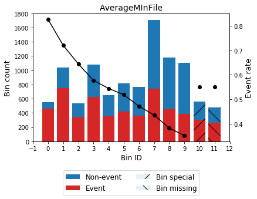

==========
OptBinning
==========

.. image::  https://travis-ci.com/guillermo-navas-palencia/optbinning.svg?branch=master
   :target: https://travis-ci.com/guillermo-navas-palencia/optbinning

.. image::  https://codecov.io/gh/guillermo-navas-palencia/optbinning/branch/master/graph/badge.svg
   :target: https://codecov.io/gh/guillermo-navas-palencia/optbinning

.. image::  https://img.shields.io/github/license/guillermo-navas-palencia/optbinning
   :target: https://img.shields.io/github/license/guillermo-navas-palencia/optbinning

.. image:: https://img.shields.io/pypi/v/optbinning?color=blue
   :target: https://img.shields.io/pypi/v/optbinning?color=blue

.. image:: https://pepy.tech/badge/optbinning
   :target: https://pepy.tech/project/optbinning

**OptBinning** is a library written in Python implementing a rigorous and flexible mathematical programming formulation
to solving the optimal binning problem for a binary, continuous and multiclass target type, incorporating constraints
not previously addressed.

**Documentation**: http://gnpalencia.org/optbinning/

**Paper**: Optimal binning: mathematical programming formulation. http://arxiv.org/abs/2001.08025

Installation
============

To install the current release of OptBinning:

.. code-block:: text

   pip install optbinning

To install from source, download or clone the git repository

.. code-block:: text

   git clone https://github.com/guillermo-navas-palencia/optbinning.git
   cd optbinning
   python setup.py install

Dependencies
------------
OptBinning requires

* matplotlib
* numpy
* ortools (>=7.2)
* pandas
* scikit-learn (>=0.22.0)
* scipy

Getting started
===============

If your are new to OptBinning, you can get started following the `tutorials <http://gnpalencia.org/optbinning/tutorials.html>`_ and checking the API references.

Example
-------

Let's load a well-known dataset from the UCI repository and choose a variable to discretize and the binary target.

.. code-block:: python

   import pandas as pd
   from sklearn.datasets import load_breast_cancer

   data = load_breast_cancer()
   df = pd.DataFrame(data.data, columns=data.feature_names)

   variable = "mean radius"
   x = df[variable].values
   y = data.target

Import and instantiate an ``OptimalBinning`` object class. We pass the variable name, its data type, and a solver, in this case, we choose the constraint programming solver. Fit the optimal binning object with arrays ``x`` and ``y``.

.. code-block:: python

   from optbinning import OptimalBinning
   optb = OptimalBinning(name=variable, dtype="numerical", solver="cp")
   optb.fit(x, y)

Check status and retrieve optimal split points

.. code-block:: python

   >>> optb.status
   'OPTIMAL'

   >>> optb.splits
   array([11.42500019, 12.32999992, 13.09499979, 13.70499992, 15.04500008,
          16.92500019])

The optimal binning algorithms return a binning table; a binning table displays the binned data and several metrics for each bin. Call the method ``build``, which returns a pandas.DataFrame.

.. code-block:: python

   >>> optb.binning_table.build()

.. code-block:: text

                      Bin  Count  Count (%)  Non-event  Event  Event rate       WoE        IV        JS
   0        [-inf, 11.43)    118   0.207381          3    115    0.974576  -3.12517  0.962483  0.087205
   1       [11.43, 12.33)     79   0.138840          3     76    0.962025  -2.71097  0.538763  0.052198
   2       [12.33, 13.09)     68   0.119508          7     61    0.897059  -1.64381  0.226599  0.025513
   3       [13.09, 13.70)     49   0.086116         10     39    0.795918 -0.839827  0.052131  0.006331
   4       [13.70, 15.05)     83   0.145870         28     55    0.662651 -0.153979  0.003385  0.000423
   5       [15.05, 16.93)     54   0.094903         44     10    0.185185   2.00275  0.359566  0.038678
   6         [16.93, inf)    118   0.207381        117      1    0.008475   5.28332  2.900997  0.183436
   7              Special      0   0.000000          0      0    0.000000         0  0.000000  0.000000
   8              Missing      0   0.000000          0      0    0.000000         0  0.000000  0.000000
   Totals                    569   1.000000        212    357    0.627417            5.043925  0.393784

You can use the method ``plot`` to visualize the histogram and WoE or event rate curve. Note that the Bin ID corresponds to the binning table index.

.. code-block:: python

   >>> optb.binning_table.plot(metric="woe")

.. image:: doc/source/_images/binning_readme_example_woe.png
   :target: doc/source/_images/binning_readme_example_woe.png

Now that we have checked the binned data, we can transform our original data into WoE or event rate values.

.. code-block:: python

   x_transform_woe = optb.transform(x, metric="woe")
   x_transform_event_rate = optb.transform(x, metric="event_rate")

The ``analysis`` method performs a statistical analysis of the binning table, computing the statistics Gini index, Information Value (IV), Jensen-Shannon divergence, and the quality score. Additionally, several statistical significance tests between consecutive bins of the contingency table are performed.

.. code-block:: python

   >>> optb.binning_table.analysis()

.. code-block:: text

   ---------------------------------------------
   OptimalBinning: Binary Binning Table Analysis
   ---------------------------------------------

     General metrics

       Gini index               0.87541620
       IV (Jeffrey)             5.04392547
       JS (Jensen-Shannon)      0.39378376
       HHI                      0.15727342
       HHI (normalized)         0.05193260
       Cramer's V               0.80066760
       Quality score            0.00000000

     Significance tests

        Bin A  Bin B  t-statistic       p-value  P[A > B]      P[B > A]
            0      1     0.252432  6.153679e-01  0.684380  3.156202e-01
            1      2     2.432829  1.188183e-01  0.948125  5.187465e-02
            2      3     2.345804  1.256207e-01  0.937874  6.212635e-02
            3      4     2.669235  1.023052e-01  0.955269  4.473083e-02
            4      5    29.910964  4.523477e-08  1.000000  9.814594e-12
            5      6    19.324617  1.102754e-05  0.999999  1.216668e-06

Print overview information about the options settings, problem statistics, and the solution of the computation. 

.. code-block:: python

   >>> optb.information(print_level=2)

.. code-block:: text

   optbinning (Version 0.5.0)
   Copyright (c) 2019-2020 Guillermo Navas-Palencia, Apache License 2.0

     Begin options
       name                         mean radius   * U
       dtype                          numerical   * d
       prebinning_method                   cart   * d
       solver                                cp   * d
       max_n_prebins                         20   * d
       min_prebin_size                     0.05   * d
       min_n_bins                            no   * d
       max_n_bins                            no   * d
       min_bin_size                          no   * d
       max_bin_size                          no   * d
       min_bin_n_nonevent                    no   * d
       max_bin_n_nonevent                    no   * d
       min_bin_n_event                       no   * d
       max_bin_n_event                       no   * d
       monotonic_trend                     auto   * d
       min_event_rate_diff                    0   * d
       max_pvalue                            no   * d
       max_pvalue_policy            consecutive   * d
       gamma                                  0   * d
       class_weight                          no   * d
       cat_cutoff                            no   * d
       user_splits                           no   * d
       user_splits_fixed                     no   * d
       special_codes                         no   * d
       split_digits                          no   * d
       mip_solver                           bop   * d
       time_limit                           100   * d
       verbose                            False   * d
     End options

     Name    : mean radius                     
     Status  : OPTIMAL                         

     Pre-binning statistics
       Number of pre-bins                     9
       Number of refinements                  1

     Solver statistics
       Type                                  cp
       Number of booleans                    26
       Number of branches                    58
       Number of conflicts                    0
       Objective value                  5043922
       Best objective bound             5043922

     Timing
       Total time                          0.06 sec
       Pre-processing                      0.00 sec   (  0.80%)
       Pre-binning                         0.00 sec   (  6.30%)
       Solver                              0.06 sec   ( 91.45%)
         model generation                  0.05 sec   ( 89.12%)
         optimizer                         0.01 sec   ( 10.88%)
       Post-processing                     0.00 sec   (  0.12%)

Benchmarks
==========

The following table shows how OptBinning compares to `scorecardpy <https://github.com/ShichenXie/scorecardpy>`_ 0.1.9.1.1 on a selection of variables from the public dataset, Home Credit Default Risk - Kaggle’s competition `Link <https://www.kaggle.com/c/home-credit-default-risk/data>`_. This dataset contains 307511 samples.The experiments were run on Intel(R) Core(TM) i5-3317 CPU at 1.70GHz, using a single core, running Linux. For scorecardpy, we use default settings only increasing the maximum number of bins ``bin_num_limit=20``. For OptBinning, we use default settings (``max_n_prebins=20``) only changing the maximum allowed p-value between consecutive bins, ``max_pvalue=0.05``.

To compare softwares we use the shifted geometric mean, typically used in mathematical optimization benchmarks: http://plato.asu.edu/bench.html. Using the shifted (by 1 second) geometric mean we found that **OptBinning** is **17x** faster than scorecardpy, with an average IV increment of **12%**. Besides the speed and IV gains, OptBinning includes many more constraints and monotonicity options.

+----------------------------+------------------+----------------+-----------------+---------------+
| Variable                   | scorecardpy_time | scorecardpy_IV | optbinning_time | optbinning_IV |
+============================+==================+================+=================+===============+
| AMT_INCOME_TOTAL           |           6.18 s |    0.010606    |      0.363 s    |   0.011705    |
+----------------------------+------------------+----------------+-----------------+---------------+
| NAME_CONTRACT_TYPE (C)     |           3.72 s |    0.015039    |      0.148 s    |   0.015039    |
+----------------------------+------------------+----------------+-----------------+---------------+
| AMT_CREDIT                 |           7.10 s |    0.053593    |      0.634 s    |   0.059311    |
+----------------------------+------------------+----------------+-----------------+---------------+
| ORGANIZATION_TYPE (C)      |           6.31 s |    0.063098    |      0.274 s    |   0.071520    |
+----------------------------+------------------+----------------+-----------------+---------------+
| AMT_ANNUITY                |           6.51 s |    0.024295    |      0.648 s    |   0.031179    |
+----------------------------+------------------+----------------+-----------------+---------------+
| AMT_GOODS_PRICE            |           6.95 s |    0.056923    |      0.401 s    |   0.092032    |
+----------------------------+------------------+----------------+-----------------+---------------+
| NAME_HOUSING_TYPE (C)      |           3.57 s |    0.015055    |      0.140 s    |   0.015055    |
+----------------------------+------------------+----------------+-----------------+---------------+
| REGION_POPULATION_RELATIVE |           4.33 s |    0.026578    |      0.392 s    |   0.035567    |
+----------------------------+------------------+----------------+-----------------+---------------+
| DAYS_BIRTH                 |           5.18 s |    0.081270    |      0.564 s    |   0.086539    |
+----------------------------+------------------+----------------+-----------------+---------------+
| OWN_CAR_AGE                |           4.85 s |    0.021429    |      0.055 s    |   0.021890    |
+----------------------------+------------------+----------------+-----------------+---------------+
| OCCUPATION_TYPE (C)        |           4.24 s |    0.077606    |      0.201 s    |   0.079540    |
+----------------------------+------------------+----------------+-----------------+---------------+
| APARTMENTS_AVG             |           5.61 s |    0.032247(*) |      0.184 s    |   0.032415    |
+----------------------------+------------------+----------------+-----------------+---------------+
| BASEMENTAREA_AVG           |           5.14 s |    0.022320    |      0.119 s    |   0.022639    |
+----------------------------+------------------+----------------+-----------------+---------------+
| YEARS_BUILD_AVG            |           4.49 s |    0.016033    |      0.055 s    |   0.016932    |
+----------------------------+------------------+----------------+-----------------+---------------+
| EXT_SOURCE_2               |           5.21 s |    0.298463    |      0.606 s    |   0.321417    |
+----------------------------+------------------+----------------+-----------------+---------------+
| EXT_SOURCE_3               |           5.08 s |    0.316352    |      0.303 s    |   0.334975    |
+----------------------------+------------------+----------------+-----------------+---------------+
| **TOTAL**                  |      **84.47 s** |**1.130907**    | **5.087 s**     | **1.247756**  |
+----------------------------+------------------+----------------+-----------------+---------------+

(C): categorical variable.
(*): max p-value between consecutive bins > 0.05.

The binning of variables with monotonicity trend peak or valley can benefit from the option ``monotonicity_trend="auto_heuristic"`` at the expense of finding a suboptimal solution for some cases. The following table compares the options ``monotonicity_trend="auto"`` and ``monotonicity_trend="auto_heuristic"``,

+----------------------------+----------------+----------------+----------------+----------------+
| Variable                   |      auto_time |        auto_IV | heuristic_time |   heuristic_IV |
+============================+================+================+================+================+
| AMT_INCOME_TOTAL           |      0.363 s   |    0.011705    |      0.322 s   |    0.011705    |
+----------------------------+----------------+----------------+----------------+----------------+
| AMT_CREDIT                 |      0.634 s   |   0.059311     |      0.469 s   |    0.058643    |
+----------------------------+----------------+----------------+----------------+----------------+
| AMT_ANNUITY                |      0.648 s   |   0.031179     |      0.505 s   |    0.031179    |
+----------------------------+----------------+----------------+----------------+----------------+
| AMT_GOODS_PRICE            |      0.401 s   |   0.092032     |      0.299 s   |    0.092032    |
+----------------------------+----------------+----------------+----------------+----------------+
| REGION_POPULATION_RELATIVE |      0.392 s   |   0.035567     |      0.244 s   |    0.035567    |
+----------------------------+----------------+----------------+----------------+----------------+
| **TOTAL**                  | **2.438 s**    | **0.229794**   | **1.839 s**    | **0.229126**   |
+----------------------------+----------------+----------------+----------------+----------------+

Observe that CPU time is reduced by 25% losing less than 1% in IV. The differences in CPU time are more noticeable as the
number of bins increases, see http://gnpalencia.org/optbinning/tutorials/tutorial_binary_large_scale.html.

Contributing
============
Found a bug? Want to contribute with a new feature, improve documentation, or add examples? We encourage you to create pull requests and/or open GitHub issues. Thanks! :octocat: :tada: :+1:

Citation
========

If you use OptBinning in your research/work, please cite the paper using the following BibTeX::

  @article{Navas-Palencia2020OptBinning,
    title     = {Optimal binning: mathematical programming formulation},
    author    = {Guillermo Navas-Palencia},
    year      = {2020},
    eprint    = {2001.08025},
    archivePrefix = {arXiv},
    primaryClass = {cs.LG},
    volume    = {abs/2001.08025},
    url       = {http://arxiv.org/abs/2001.08025},
  }